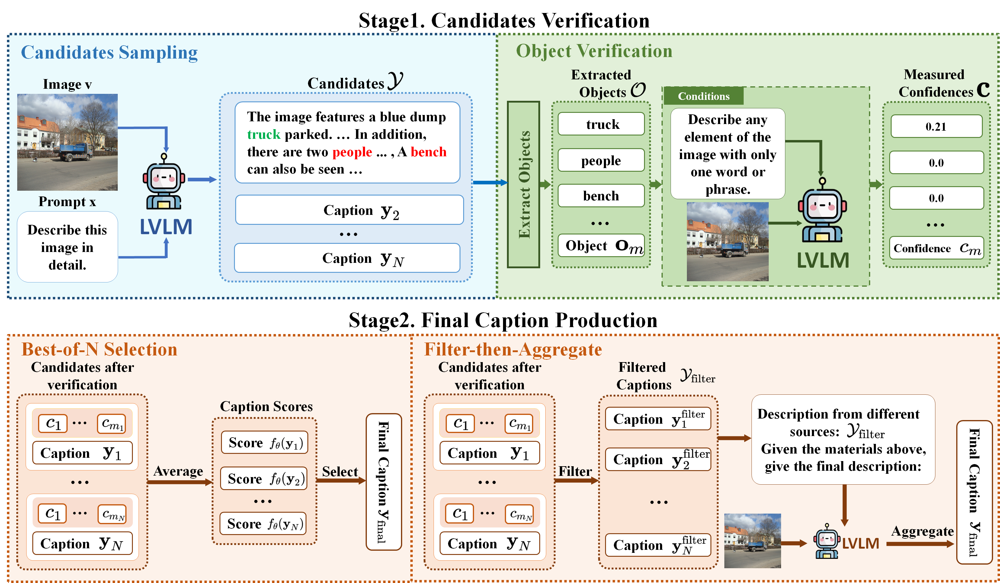

<div align="center"> 

# Countering the Over-Reliance Trap: Mitigating Object Hallucination for LVLMs via a Self-Validation Framework
</div> 


<div align="center"> 

[](https://arxiv.org/abs/2601.22451)
[](https://opensource.org/licenses/MIT) 

</div> 

## Overview
<div align="center">

</div>

---

**Problem**: Object hallucination in LVLMs—generating descriptions of non-existent objects worsens as generation length increases.

**Root Cause**: Models over-rely on language priors rather than visual evidence.

**Solution**: A training-free **Self-Validation Framework** with two steps:

1. **Candidates Verifications**: Sample multiple candidate captions, extract candidate objects, and verify each object's existence via Language-Prior Free Verfication (LPFV).

2. **Final Caption Production**:
   - **Best-of-N (BoN)**: Select the caption with highest verification confidence
   - **Filter-then-Aggregate (FtA)**: Filter low-confidence objects and aggregate into final caption

**Results**: 65.6% improvement on CHAIR_I with LLaVA-v1.5-7B, surpassing prior SOTA methods.


## Table of Contents
1. [Environment Setup](#1-environment-setup)
2. [Data Preparation](#2-data-preparation)
3. [Re-implementation](#3-re-implementation)
4. [CHAIR Evaluation](#4-chair-evaluation)
5. [Acknowledgement](#5-acknowledgement)

---

## 1. Environment Setup
```bash
conda create -yn selfval python=3.10
conda activate selfval
pip install -r requirements.txt
```

## 2. Data Preparation

Following [less-is-more](https://github.com/yuezih/less-is-more) project. The test set used in our paper for CHAIR evaluation is provided in [./chair500/chair-500.jsonl](./chair500/chair-500.jsonl). The data is randomly sampled from the MSCOCO validation set with a random seed of 0.

To collect test set images, you can open an [OneDrive link](https://1drv.ms/u/c/97dec68abb271787/ERCcXm0ZeiFGl96K6tG1xz4Bs0YYDFu9pcSA6OacLgZhTw?e=8e6eA8) to download the 500 images.

To collect the corresponding object ground truth (annotations) data:
http://images.cocodataset.org/annotations/annotations_trainval2014.zip

## 3. Re-implementation

Then, you can use our proposed Best-of-N Selection (BoN) or Filter-then-Aggregate (FtA) methods through completing these arguments:
```bash
# For BoN
"$PYTHON_PATH" -m llava.eval.selection \
    --model-path $MODEL_PATH \
    --question-file $QUESTION_FILE \
    --answers-file $OUTPUT_PATH \
    --sample-num $SAMPLE_NUM \
    --extract-method mscoco \
    --cache $CACHE_PATH \
    --image-dir $IMAGEDIR


# For FtA
python -m llava.eval.aggreagate \
    --model-path $MODEL_PATH \
    --question-file $QUESTION_FILE \
    --answers-file $OUTPUT_PATH \
    --sample_num $SAMPLE_NUM \
    --extract-method $EXTRACTE_METHOD \
    --cache $CACHE_PATH \
    --image-dir $IMAGEDIR
```

`MODEL_PATH` is llava model path.

`QUESTION_FILE` is the path of `chair-500.jsonl`, as the model input.

`OUTPUT_PATH` is the output path of result path.

`SAMPLE_NUM` is the sampling times.

`EXTRACTE_METHOD` can be chosen from `['mscoco', 'self', 'statis']`.

`CACHE_PATH` is the path of chair.pkl, positioned in `chair500/chair.pkl`.

`IMAGEDIR` is the image dir of chair-500.


For Best-of-N Selection (BoN), run `scripts/selection.sh`. For Filter-then-Aggregate (FtA), run `scripts/aggregation.sh`.


## 4. CHAIR Evaluation

We have provided CHAIR evaluation metric in [eval_chair500.sh](chair500/eval_chair500.sh).


## 5. Acknowledgement

This repo is built on [LLaVA](https://github.com/haotian-liu/LLaVA) (models), [VCD](https://github.com/DAMO-NLP-SG/VCD) and [Less-is-more](https://github.com/yuezih/less-is-more) (CHAIR evaluation). Many thanks for their efforts. The use of our code should also follow the original licenses.
